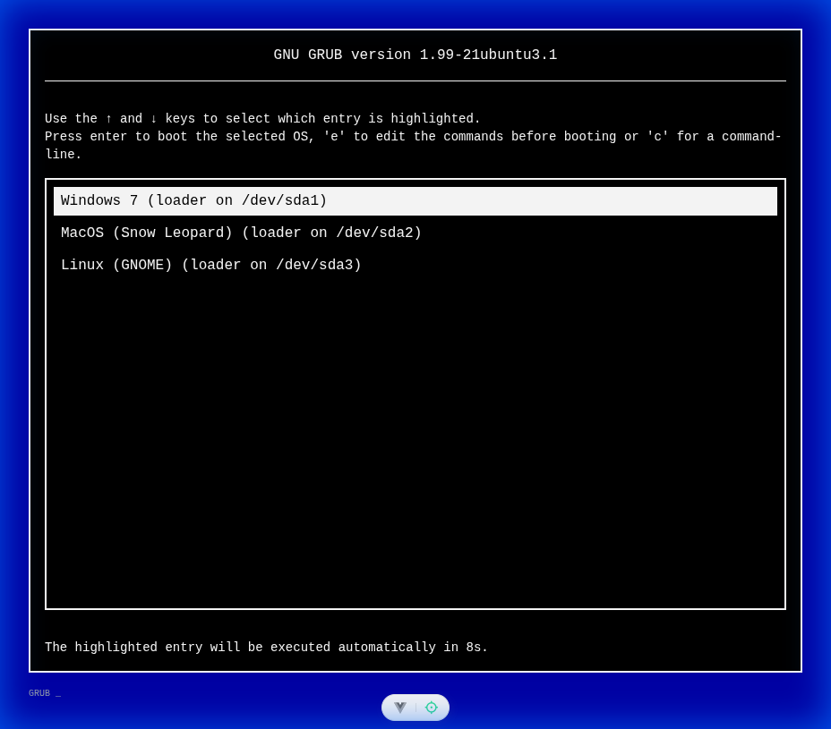
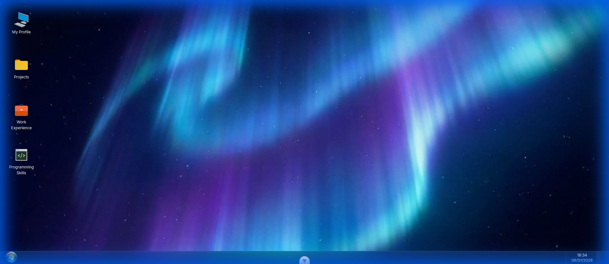
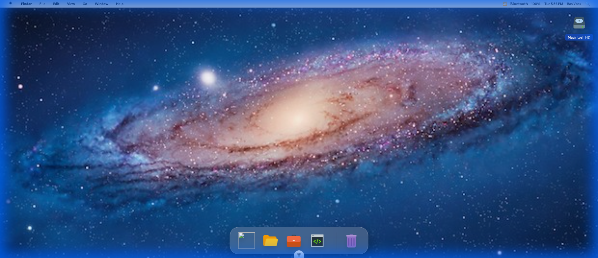

# Interactive Portfolio OS

A unique, web-based portfolio that mimics multiple operating system environments. Choose your "boot" experience and explore projects and skills within a familiar desktop interface.

## 🚀 Experience the OS

This portfolio features a full "boot" sequence starting from a GRUB-inspired menu, leading into your choice of three distinct desktop environments.

### 🖥️ OS Options

- **Windows 7**: A nostalgic trip with the classic orb, aero-style elements, and the iconic boot animation.
- **macOS**: Sleek design with a functional dock and minimal aesthetics.
- **Linux (GNOME)**: A modern desktop experience inspired by the GNOME desktop environment.

## 📸 Screenshots

|                GRUB Bootloader                 |                 Windows 7 Desktop                 |
| :--------------------------------------------: | :-----------------------------------------------: |
|  |  |

|                 macOS Desktop                  |             Linux (GNOME) Desktop              |
| :--------------------------------------------: | :--------------------------------------------: |
|  |  |

## 🛠️ Tech Stack

- **Framework**: [Vue 3](https://vuejs.org/) (Composition API)
- **Build Tool**: [Vite](https://vitejs.dev/)
- **Styling**: [Tailwind CSS](https://tailwindcss.com/)
- **Language**: [TypeScript](https://www.typescriptlang.org/)

## 🚀 Getting Started

### Prerequisites

- Node.js (Version 20.19.0 or higher)

### Setup

```sh
npm install
```

### Development

```sh
npm run dev
```

### Build

```sh
npm run build
```

## 📂 Project Structure

- `src/components/win7`: Windows 7 specific components and styling.
- `src/components/macos`: macOS specific components.
- `src/components/linux`: Linux/GNOME specific components.
- `src/components/shared`: UI elements shared across all environments.
- `src/composables`: Logic for window management and OS state.
